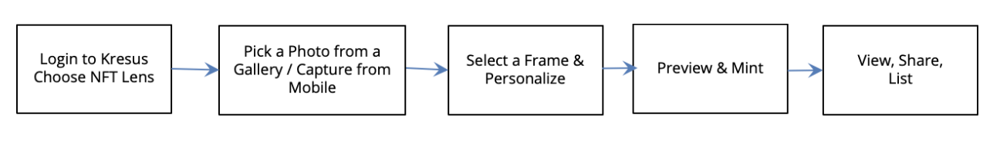

# NFT Lens

This project mainly consists of 2 contracts:
  1. ERC1155URIStorage - an openzeppelin standard which is an extension of ERC1155.
  2. NFTLens - contract inherited from ERC1155URIStorage which is a wrapper contract consisting mint functionality.

### Overview ###
NFTLens is a self-minting and gifting feature inside Kresus Application intended for new users to experience the web3 ecosystem & NFT technology. This overview describes how NFTLens fits into the overall Kresus application.

NFTLens allows users to mint their special moments as NFTs using the Kresus application. The NFTs minted by the users can be shared with their family and friends and uploaded to social media handles - Twitter, Facebook, Instagram, and Whatsapp.

This contract will be deployed in Polygon Mumbai Testnet & Mainnet. 
NFT Metadata will be stored on IPFS through Pinata gateway.




### Functionalities ###
* Mint - Function in NFTLens which internally calls `_mint()` of parent ERC1155 contract to mint a new token ID. Also calls `_setURI()` in ERC1155URIStorage to store the external link to the metadata of a particular tokenID. Once URI is set for a tokenID it cannot be changed, hence maintaining immutability of the NFT token.
  * _to(address) - to which NFT is to be minted.
  * _amount(uint256) - amount to be minted.
  * _tokenURI(string) - external link to metadata of token.
  * _data(bytes) - extra bytes data for smart contract call.

* URI - Function in ERC1155URIStorage which gives the tokenURI stored for a tokenID. TokenURIs are stored in a mapping of tokenID to tokenURI in this contract.
  * tokenId(uint256) - tokenId of which tokenURI is needed.

# Getting Started

## Requirements
- [git](https://git-scm.com/book/en/v2/Getting-Started-Installing-Git)
  - You'll know you did it right if you can run `git --version` and you see a response like `git version x.x.x`
- [Nodejs](https://nodejs.org/en/)
  - You'll know you've installed nodejs right if you can run:
    - `node --version` and get an output like: `vx.x.x`
- [Yarn](https://yarnpkg.com/getting-started/install) instead of `npm`
  - You'll know you've installed yarn right if you can run:
    - `yarn --version` and get an output like: `x.x.x`
    - You might need to [install it with `npm`](https://classic.yarnpkg.com/lang/en/docs/install/) or `corepack`


## Quickstart

```
git clone git@github.com:Kresus-Labs-Inc/nft-lens.git
cd nft-lens
yarn
npx hardhat compile
```

# Usage

Deploy:
```
npx hardhat run scripts/deploy.js --network <network-name>
```

## Local Deployment

If you'd like to run your own local hardhat network, you can run:

```
npx hardhat node
```

And then **in a different terminal**

```
npx hardhat run scripts/deploy.js --network hardhat
```

And you should see transactions happen in your terminal that is running `npx hardhat node`

## Deployment to a testnet or mainnet

1. Setup environment variables
> Sample environment variables can be found in .env-example file.

2. Get native token

3. Deploy

```
npx hardhat run scripts/deploy.js --network mumbai
npx hardhat run scripts/deploy.js --network polygon
```
